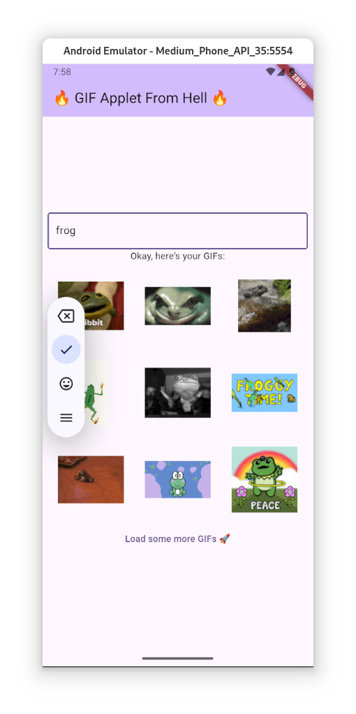

# Take-home assignment for Chili Labs

I was ghosted, btw.

### Flutter version

*flutter_linux_3.27.2-stable*

## Images

I have not used Flutter before, but I managed put something together in a couple of hours.

Every code change takes 2 minutes to compile, VSCode keeps running out of RAM all the time and keeps crashing.

I have no idea how anyone can make anything with these tools.

## Task

Create a gif search application using the Giphy service

## Requirements

### Primary platforms - iOS & Android

I am too poor to afford an iOS or an Android, but it seems like it works in the Android emulator.

### Auto search - requests to retrieve Gif information from the service are made automatically with a small delay after user stops typing

I have no idea what an *auto search* is, but I delayed the search requests for 1 second after the last input.

### Pagination - loading more results when scrolling

I added a button at the bottom of the GIF list to load in more GIFs.

You could trigger it automatically when the user scrolls to the bottom of the GIF list, but this would cause performance issues.

### Vertical & horizontal orientation support

The layout is slightly different between vertical and horizontal orientations.

### Error handling

I never encountered an error, so I don't know if it works, but the errors should be handled.

### Unit tests - as much as you see fit

The app contains no complicated business logic, some kind of end-to-end testing would probably be more productive. 

## UI

### Responsive & matching platform guidelines

I have no idea how responsive the app is, the emulator is very laggy.

### At least 2 views sourced by data from Giphy

There is a grid with GIFs on one page and a larger single GIF display on another page.

### Results are displayed in a grid

Yes.

### Clicking on a grid item should navigate to a detailed Gif view

Yes.

### Loading indicators

There is some text and emojis.

### Error display

There should be an error display, but I didn't encounter any errors.
